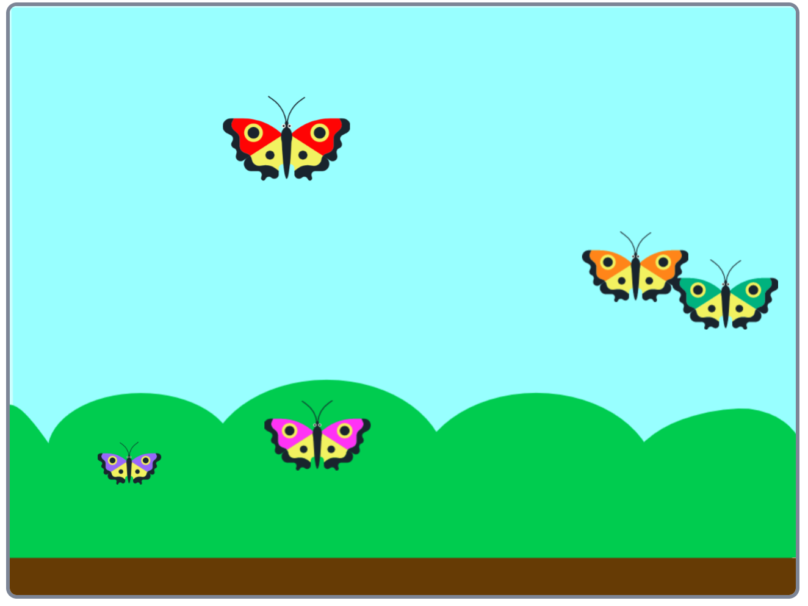

## Introduction

Watching nature is a brilliant way to relax but wildlife doesn’t always come along when you want it to. In this project you’ll make a Butterfly Garden where each butterfly flies in exactly the pattern you tell it to.

### What you will make

--- no-print ---
Click the green flag and sit back and relax and watch the patterns the butterflies make as they fly.

<iframe src="https://scratch.mit.edu/projects/403091557/embed" allowtransparency="true" width="485" height="402" frameborder="0" scrolling="no" allowfullscreen></iframe>

--- /no-print ---

--- print-only ---

--- /print-only ---

--- collapse ---
---
title: What you will need
---
### Hardware

+ A Computer

### Software

+ Scratch 2.0 (either [online](http://rpf.io/scratchon) or [offline](http://rpf.io/scratchoff)

### Downloads

+ [rpf.io/project-name-go](http://rpf.io/butterfly-garden-go){:target="_blank"}

--- /collapse ---

--- collapse ---
---
title: What you will learn
---

+ Costumes
+ Repetition

--- /collapse ---

--- collapse ---
---
title: Additional information for educators
---

If you need to print this project, please use the [printer-friendly version](https://projects.raspberrypi.org/en/projects/butterfly-garden/print){:target="_blank"}.

[Here is a link to the resources for this project](http://rpf.io/butterfly-garden-get).

--- /collapse ---
