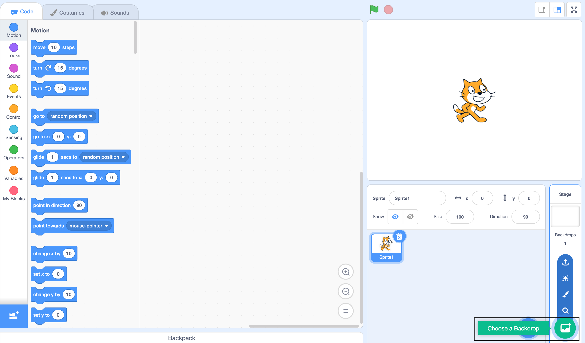
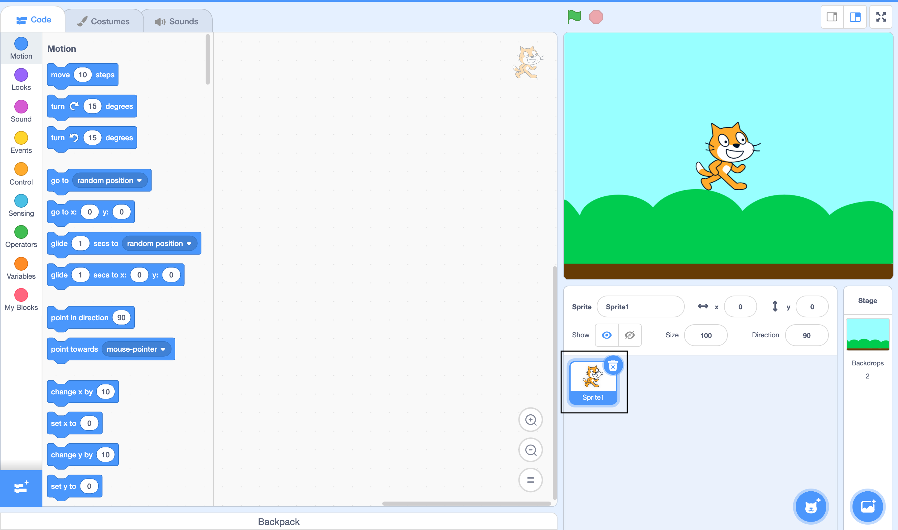
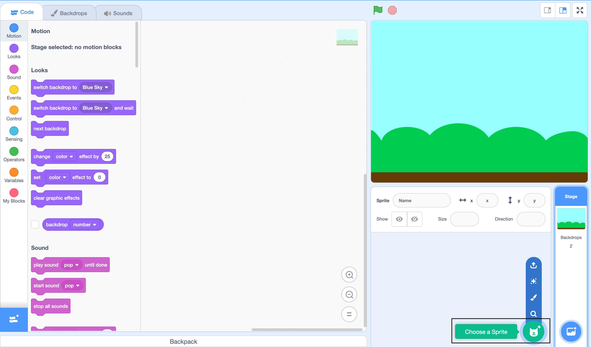
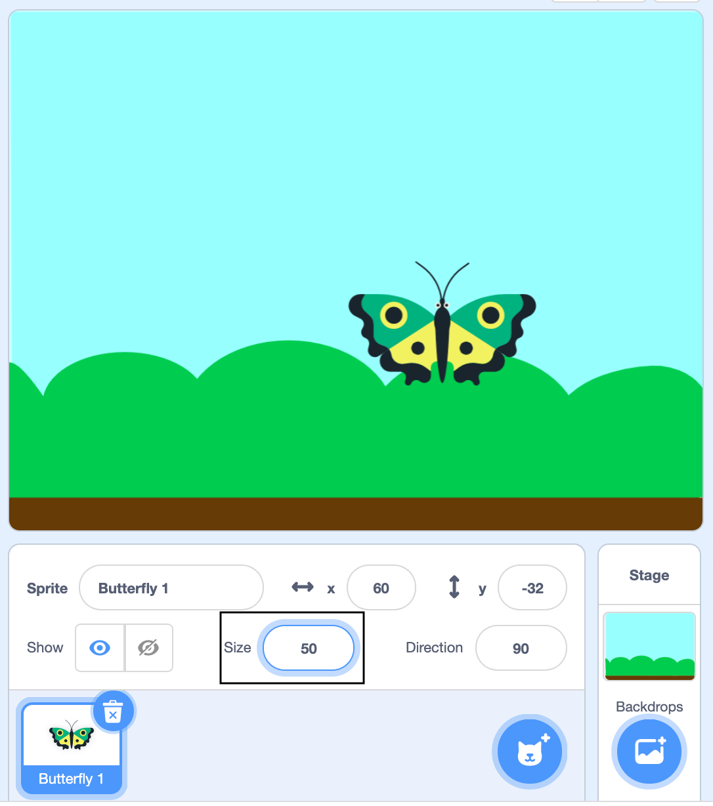
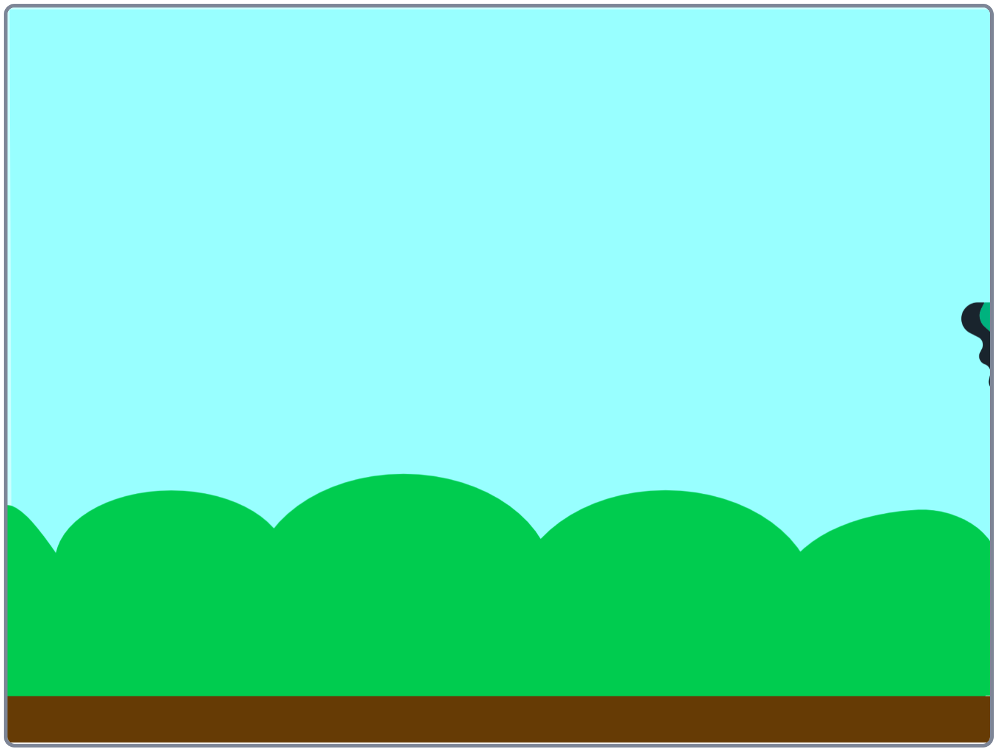
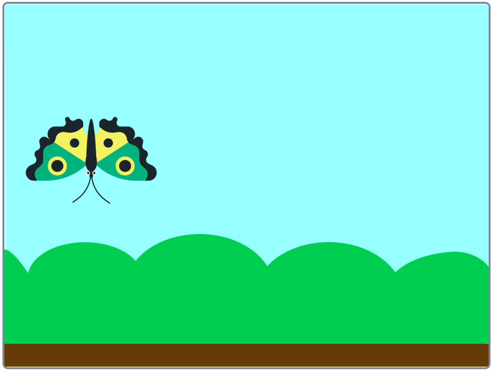
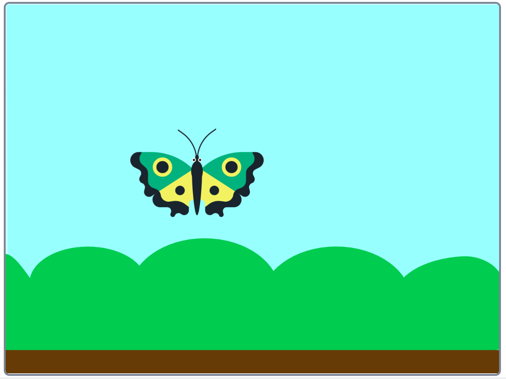

## Add a butterfly
You're going to add a butterfly that flies left and right across the stage. 

--- task ---
Click 'Choose a Backdrop' and then select the 'Blue Sky' backdrop. 


--- /task ---

--- task ---
Delete the Cat sprite. 



--- /task ---

--- task ---
Click 'Choose a Sprite' and add the 'Butterfly 1' sprite to your project.



--- /task ---

--- task ---
The butterfly is a bit big. Change its size to 50% (half as big).


--- /task ---

--- task ---
Click on the Code tab and then 'Motion' to see the motion blocks. These blocks make sprites move around the stage. 


--- /task ---

--- task ---
Click on the `move (10) steps`{:class="block3motion"} block a few times and watch your butterfly move across the stage. 
--- /task ---

Now you're going to make the butterfly move when your project is started by clicking the green flag above the stage. 


--- task ---
Drag a `when flag clicked`{:class="block3events"} block from `Events` to the stage. 

```blocks3
when flag clicked
```
The code under the `when flag clicked`{:class="block3events"} block will run when you click the green flag. 

--- /task ---

--- task ---
+ Add a `forever`{:class="block3events"} block from `Control` and snap it in place under the `when flag clicked` block.

```blocks3
when flag clicked
+forever
end
```

Code blocks inside a `forever`{:class="block3control"} block will run over and over again. 

__Tip:__ Notice the difference in colour between `Events` and `Control` blocks. 

--- /task ---

--- task ---
Now add a `move (10) steps`{:class="block3motion"} block inside the `forever`{:class="block3events"} block.

```blocks3
when flag clicked
forever
+move (10) steps
end
```

--- /task ---

--- task ---
Click the green flag to start your project. 

Your butterfly should fly to the right of the stage and then get stuck. 



--- /task ---

--- task ---
To fix this, add an `if on edge bounce`{:class="block3motion"} block. This block makes a sprite flip its direction if it bumps into the edge of the screen. 

```blocks3
when flag clicked
forever
move (10) steps
+if on edge bounce
end
```
--- /task ---

--- task ---
Click the green flag to restart your project and the butterfly should now fly across the stage, bouncing when it reaches the left and right edges. 
--- /task ---

Did you spot a problem? The butterfly goes upside down when it flies to the left. This is because sprites point in the direction they are moving. 



--- task ---
You can fix this by clicking on the `set rotation style [left-right]`{:class="block3motion"} block. 



--- /task ---

--- task ---
Click the green flag again and your butterfly should stay the right way up!
--- /task ---

The butterfly garden is supposed to be relaxing but the butterfly is flying very fast. 

--- task ---
Slow the butterfly down by changing the number of steps that it moves at a time from `10` to `2`:

```blocks3
when flag clicked
forever
+move (2) steps
if on edge bounce
end
```
--- /task ---

--- task ---
Click the green flag and watch your butterfly move. 
--- /task ---


