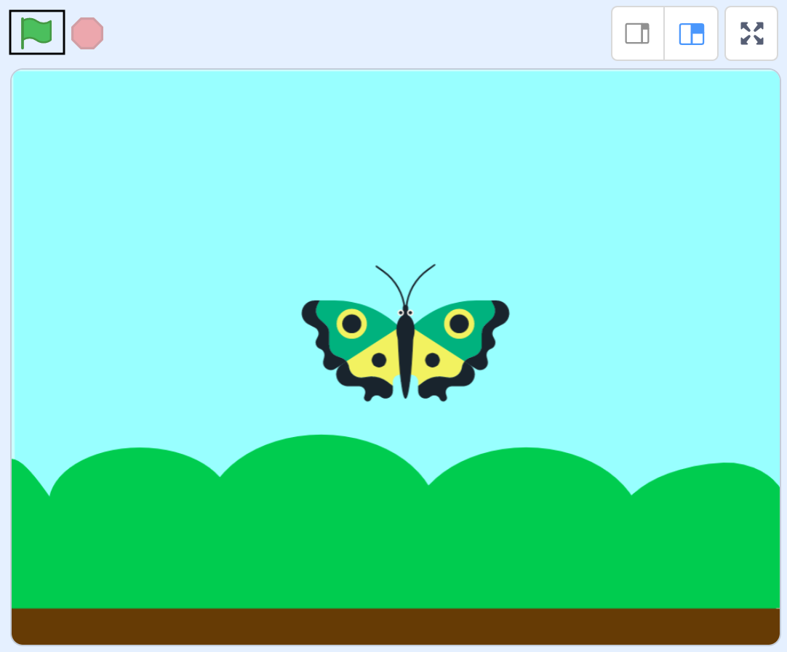

## Add a flying butterfly
First, you will add a butterfly that flies left and right across the Stage. 

--- task ---

Open a new Scratch project.

**Online:** open a new online Scratch project at [scratch.mit.edu](https://scratch.mit.edu/projects/editor){:target="_blank"}.

**Offline:** open a new project in the Scratch offline editor. If you need to, you can [download and install Scratch here](https://scratch.mit.edu/download){:target="_blank"}.

--- /task ---

--- task ---

--- no-print ---

Watch this short video, which shows what to do next.

 

--- /no-print ---

--- /task ---

Follow the instructions for each task below.

--- task ---
Click on **Choose a Backdrop**, then select the **Blue Sky** backdrop. 


--- /task ---

--- task ---
Delete the cat sprite. 


--- /task ---

--- task ---
Click on **Choose a Sprite** and add the **Butterfly 1** sprite to your project.


--- /task ---

--- task ---
Now, add your project name and save your project so far. Go to **File** in the menu. If you have a Scratch account, click on **Save now**. If you do not have an account, click on **Save to your computer**.


--- /task ---

--- no-print ---

--- task ---

Watch this short video, which shows what to do next.


--- /task ---

--- /no-print ---

Follow the instructions for each task below.

--- task ---
Click on the **Code** tab, then select `Motion`{:class="block3motion"} to see the `Motion`{:class="block3motion"} blocks available. These blocks make sprites move around the Stage. 

{:width="300px"}
--- /task ---

--- task ---
Click on the `move 10 steps`{:class="block3motion"} block a few times and watch your butterfly move across the Stage. 
--- /task ---

Now, you will make the butterfly move when you click on the green flag above the Stage to start your project. 

{:width="400px"}

--- task ---
From the `Events`{:class="block3events"} blocks menu, select a `when green flag clicked`{:class="block3events"} block and drag it into the Code area. 

```blocks3
when flag clicked
```
The code under the `when green flag clicked`{:class="block3events"} block will run when you click on the green flag. 

--- /task ---

--- task ---
From the `Control`{:class="block3control"} blocks menu, add a `forever`{:class="block3control"} block and connect it in place under the `when green flag clicked`{:class="block3events"} block.

```blocks3
when flag clicked
+forever
end
```

Code blocks inside a `forever`{:class="block3control"} block will run over and over again. 

**Tip:** Notice the subtle colour difference between `Events`{:class="block3events"} (yellow) and `Control`{:class="block3control"} (orange) blocks.

--- /task ---

--- task ---
Now, add a `move 10 steps`{:class="block3motion"} block inside the `forever`{:class="block3control"} block.

```blocks3
when flag clicked
forever
+move (10) steps
end
```

--- /task ---

--- task ---
Click on the green flag to start your project. 

Your butterfly should fly to the right of the Stage and then get stuck.

{:width="400px"}

--- no-print ---

Watch this short video. Is your butterfly getting stuck like this?


--- /no-print ---

--- /task ---

--- task ---
To solve the problem of the stuck butterfly, add an `if on edge, bounce`{:class="block3motion"} block. This block makes a sprite change its direction if it bumps into the edge of the Stage.

```blocks3
when flag clicked
forever
move (10) steps
+if on edge, bounce
end
```
--- /task ---

--- task ---
Click on the green flag to restart your project. The butterfly should now fly across the Stage, and it should bounce when it reaches the left and right edges. 
--- /task ---

Did you spot an issue? The butterfly goes upside down when it flies to the left. This is because sprites point in the direction in which they are moving. 

{:width="400px"}

--- task ---
To fix this, add a `set rotation style left-right`{:class="block3motion"} block under the `when green flag clicked`{:class="block3events"} block.

{:width="400px"}

```blocks3
when flag clicked
+set rotation style [left-right v]
forever
move (10) steps
if on edge, bounce
end
```

--- /task ---

--- task ---
Click on the green flag again. Your butterfly should stay the right way up!
--- /task ---

The butterfly garden is supposed to be relaxing, but the butterfly is flying very fast. 

--- task ---
To slow the butterfly down, change the number of steps that it moves at a time from `10` to `2`:

```blocks3
when flag clicked
set rotation style [left-right v]
forever
+move (2) steps
if on edge, bounce
end
```
--- /task ---

--- task ---
Click on the green flag and watch your butterfly move. 
--- /task ---

--- save ---


