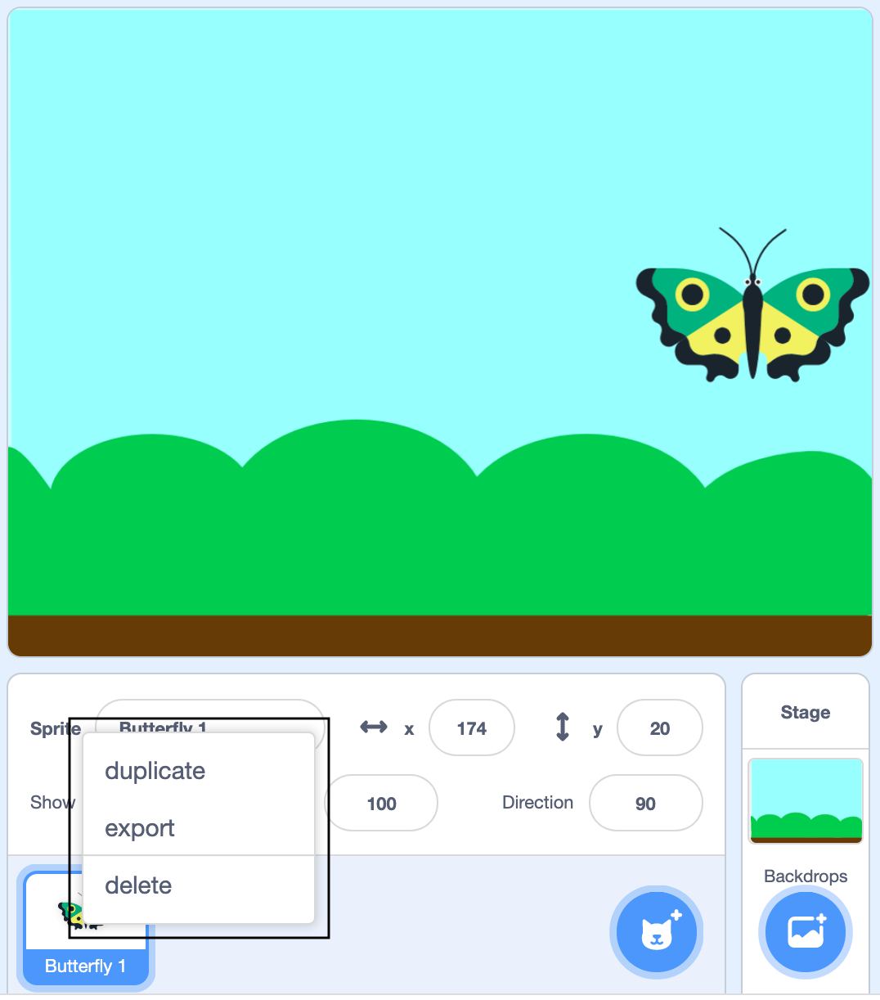
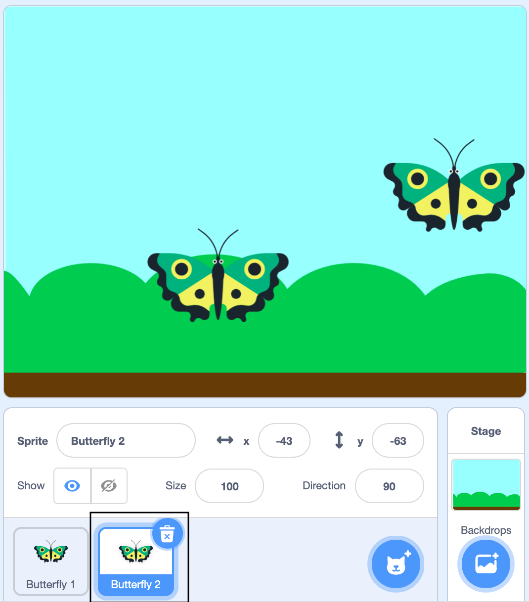
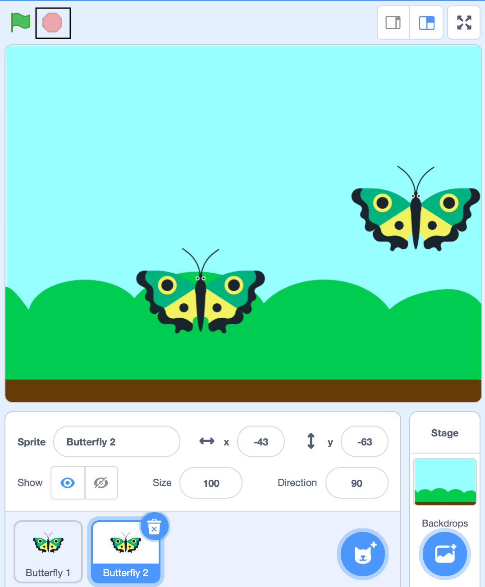
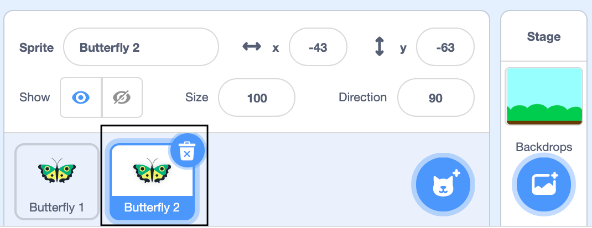
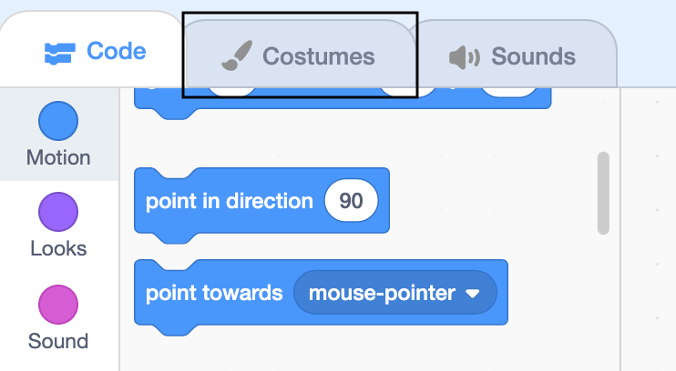
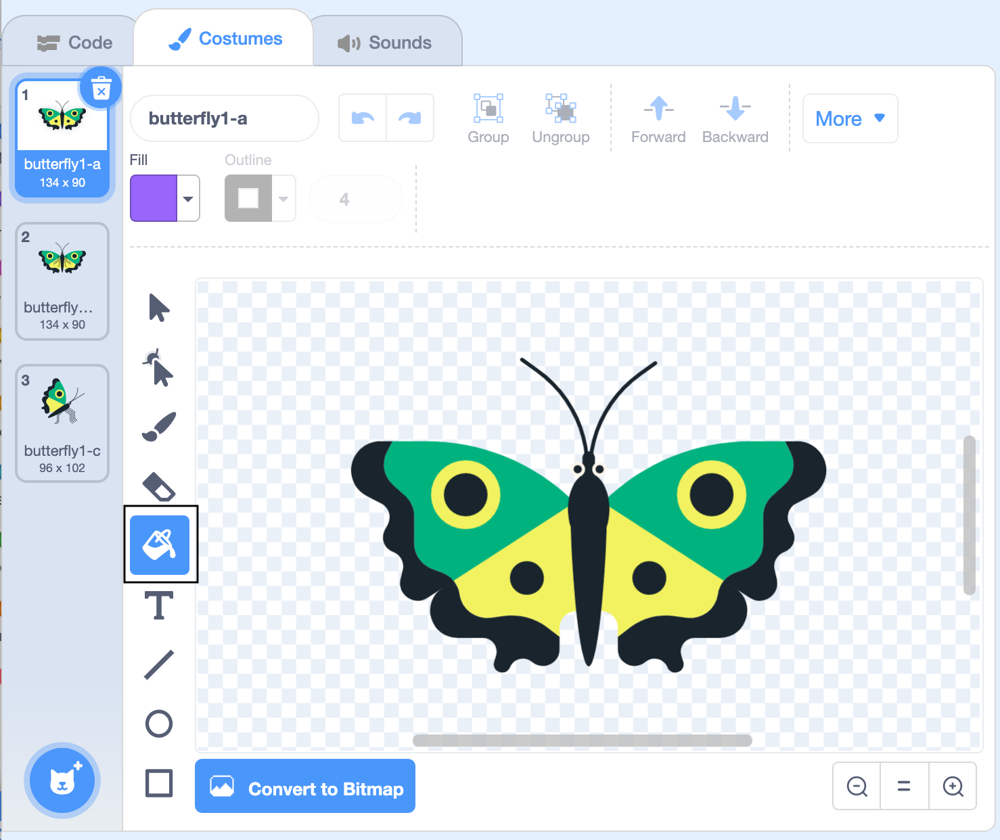
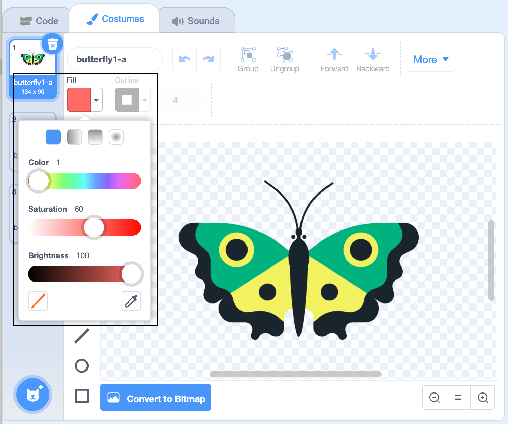
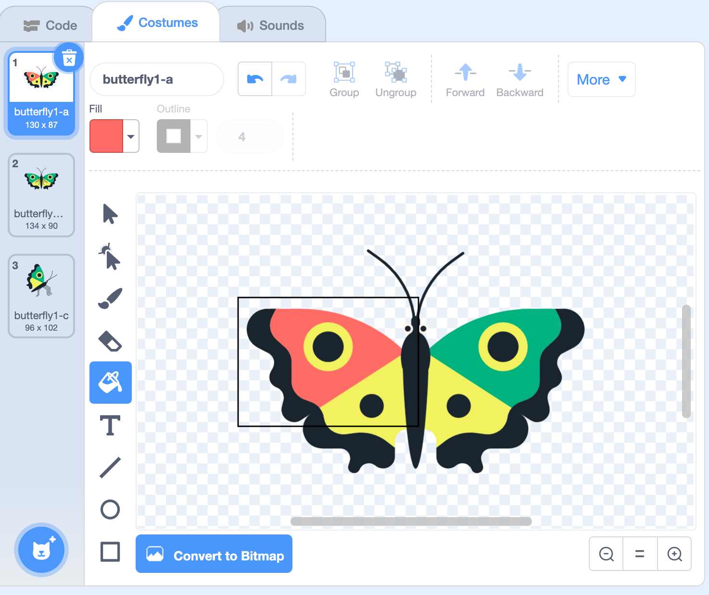
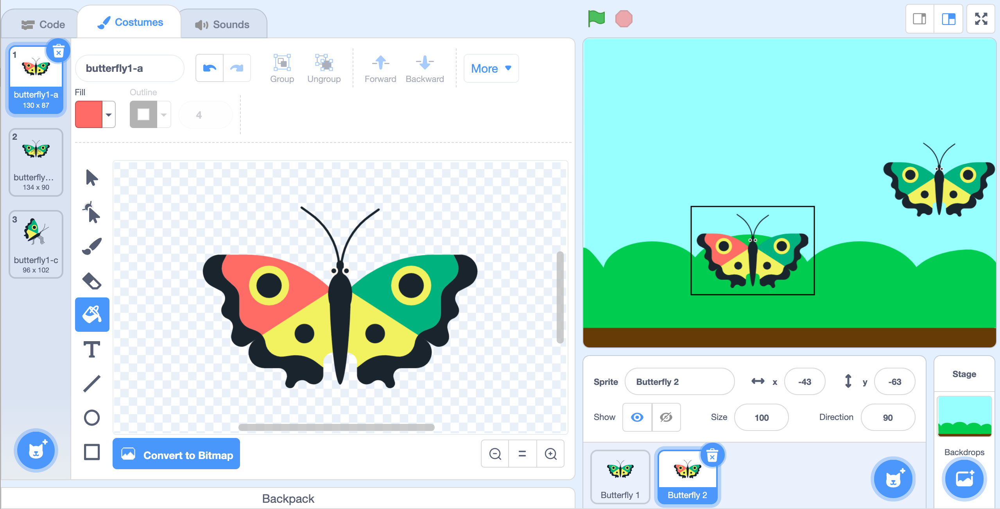
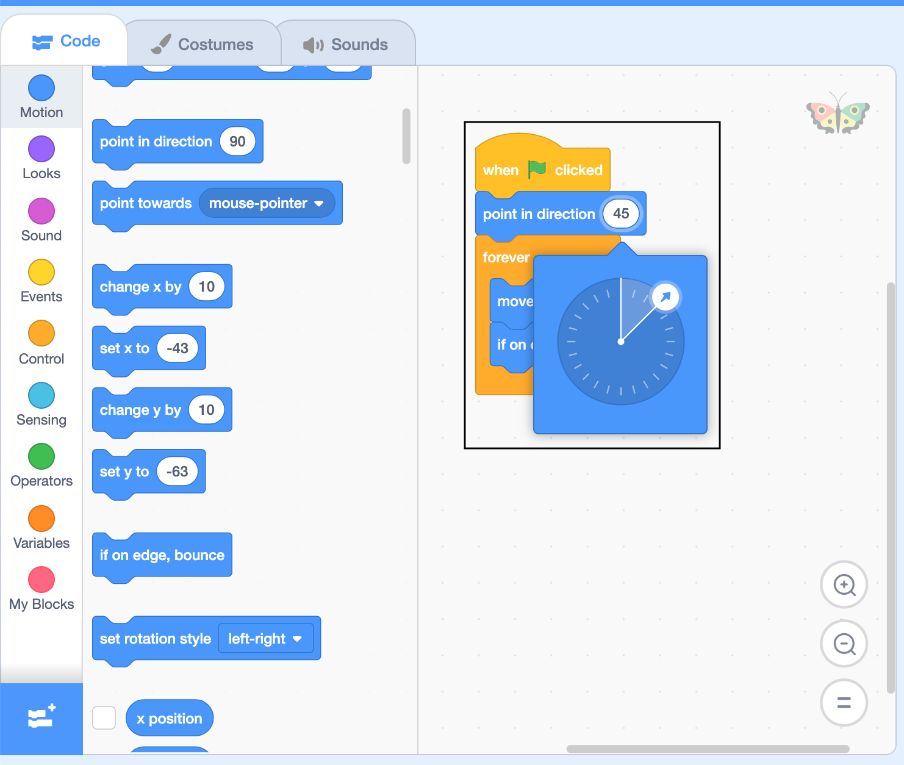

## Flying at an angle

Now you're going to add another butterfly but this time it's going to fly at an angle to create a different flight pattern. 

The code for this butterfly is going to be similar to the code for Butterfly 1. You could add the code again but it's quicker to duplicate (copy) the sprite. 

--- task ---
Right click on 'Butterfly 1' below the stage (or tap and hold on a tablet) and select 'duplicate' from the menu that appears:

{:width="400px"}

--- /task ---

This will create a copy of the 'Butterfly 1' sprite called 'Butterfly 2'. 

{:width="400px"}

The costumes, code and settings such as the size and rotation style are copied to the new sprite. 

--- task ---
Click the green flag to see both butterflies move. 

--- /task ---

--- task ---
Click the red stop button above the Stage to stop the butterflies moving. 

{:width="400px"}

--- /task ---

Now you're going to change the colour of Butterfly 2 so you can easily tell them apart. 

--- task ---
Click on 'Butterfly 2' under the Stage.


--- /task ---

--- task ---
Click on the Costumes tab. 



--- /task ---

--- task ---
Click on the Fill (paint bucket) tool.  



--- /task ---

--- task ---
Click on the Fill colour and change the sliders to get a colour you like. 



--- /task ---

--- task ---
Click on the green parts of the butterfly wing to fill them with your new colour. 



--- /task ---

The colour of Butterfly 2 will also change on the Stage and under the Stage. 



--- task ---
Butterfly 2 also has its own code. Make sure Butterfly 2 is still selected below the stage and click on the Code tab. 

--- /task ---

Butterfly 2 has the same code as Butterfly 1. You are going to change it so Butterfly 2 flies in a different pattern.

--- task ---
Add a `point in direction`{:class="block3motion"} block after `when flag clicked`{:class="block3events"}. A gap will open up and the block will snap into place.

```blocks3
when flag clicked
set rotation style [left right v]
+point in direction (90)
forever
move (10) steps
if on edge bounce
end
```

--- /task ---

The number '90' in `point in direction`{:class="block3motion"} means point to the right which is why the butterfly flies to the right to start with. '0' means point up towards the top of the stage. You're going to make Butterfly 2 fly at a 45 degree angle. 

--- task ---
Click on the number `(90)`{:class="block3motion"} in the `point in direction`{:class="block3motion"} block and change the number to `45`{:class="block3motion"}. You can do this by moving the arrow that appears, or just by typing '45'.



--- /task ---

--- task ---
Check that your code looks like this:

```blocks3
when flag clicked
set rotation style [left right v]
+point in direction (45)
forever
move (10) steps
if on edge bounce
end
```
--- /task ---

--- task ---
Click the green flag to see Butterfly 2 move in its new pattern.

--- /task ---

--- save ---
