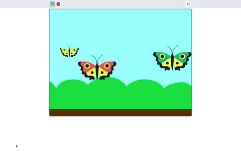
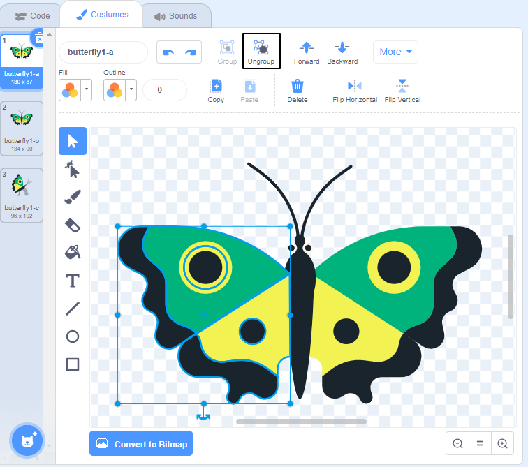
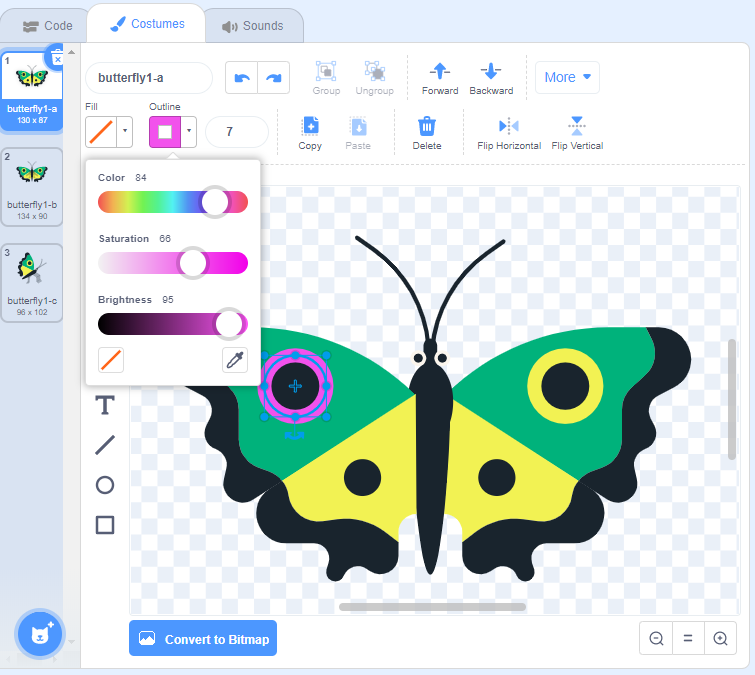
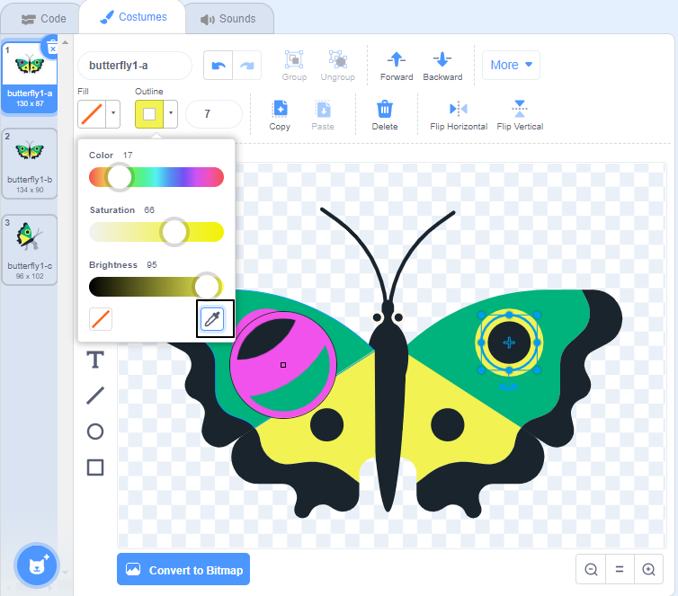

## Make a small butterfly
Now, you will add a small butterfly that flies at a different angle and flies behind the other butterflies.

--- task ---
Duplicate the **Butterfly 2** sprite to create a **Butterfly 3** sprite. 

--- /task ---

--- task ---
Make the **Butterfly 3** sprite fly in a different direction. What happens if you choose a negative number?


**Tip:** Each sprite has its own costumes and code. Make sure that you select the correct sprite in the Sprite list below the Stage before you click on the **Costumes** or **Code** tabs. 

--- /task ---

--- task ---

Change the colour of the **Butterfly 3** sprite's wings so that it looks different to the others. To do this, edit its costume with the **Fill** tool.

--- /task ---

All the butterflies are the same size. The scene will look more realistic if the **Butterfly 3** sprite is smaller and set behind the other butterflies.

--- task ---

Make the **Butterfly 3** sprite half the size (50%) of the other butterflies. From the `Looks`{:class="block3looks"} blocks menu, add a `set size to`{:class="block3looks"} block and set the size to `50` (percent):

```blocks3
when flag clicked
set rotation style [left-right v]
point in direction (-45)
+set size to (50)%
forever
move (2) steps
if on edge, bounce
end
```
--- /task ---

Now, you need to set the **Butterfly 3** sprite so that it is layered behind the other butterflies. 

--- task ---

Go to the `Looks`{:class="block3looks"} blocks menu again. Add a `go to front layer`{:class="block3looks"} block and select `back`{:class="block3looks"} in the drop-down menu:

```blocks3
when flag clicked
set rotation style [left-right v]
point in direction (-45)
set size to (50)%
+go to [back v] layer
forever
move (2) steps
if on edge, bounce
end
```
--- /task ---

--- task ---

Click on the green flag to check your program. Is the **Butterfly 3** sprite smaller than the other butterfly sprites? Also, is it flying behind them?

--- no-print ---



--- /no-print ---

--- /task ---

--- task ---

Get creative and decorate your own butterfly costume with the tools in the Paint editor.The circles are outlines of a circle shape, so you can't use the **Fill** tool. 

+ First, click on a wing. 
+ Then, click on **Ungroup** to separate the objects.



+ Click on the circle that you separated on the wing.
+ Now, you can change the **Outline** colour for the circle. 



Repeat these steps for the other wing. You can use the **Colour picker** tool to choose the same colour as you used for the other wing.



--- /task ---

--- save ---
