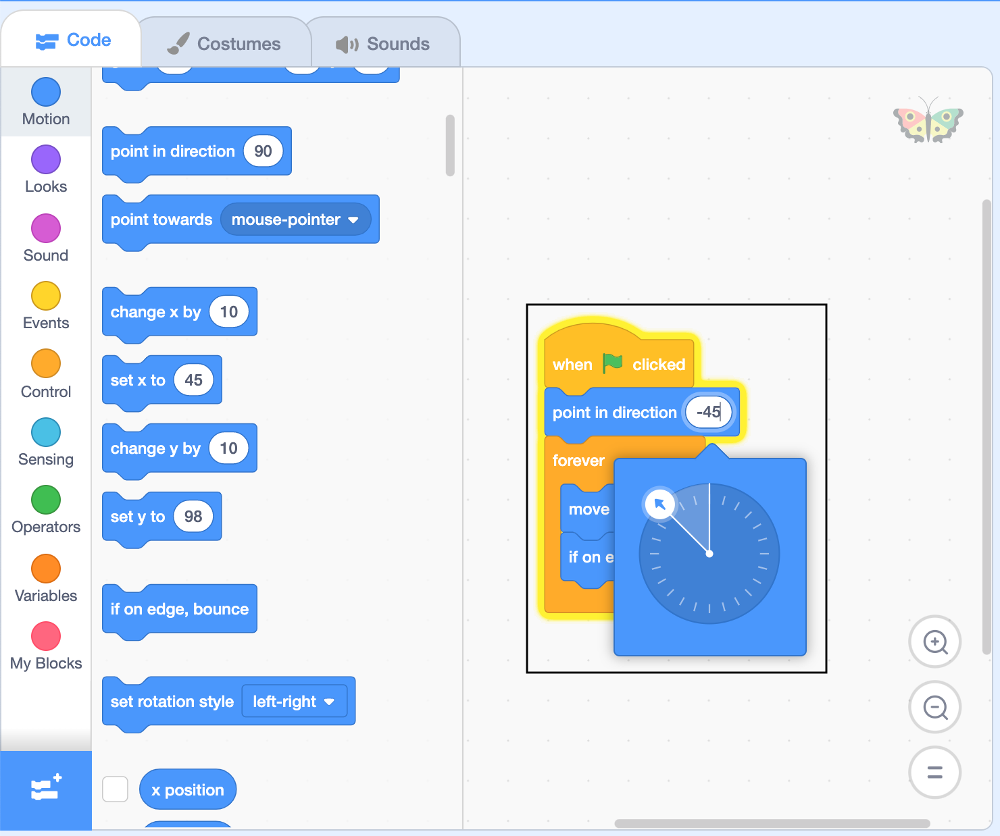

## Add a small butterfly

Duplicate Butterfly 2 to create Butterfly 3. Use what you have learned to make this butterfly different to the others. 

--- task ---
Change the colour of the butterfly's wings by editting its costume with the Fill tool.

Make your butterfly fly in a different direction. What happens if you choose a negative number?

__Tip:__ Make sure you select the sprite you want to change under the stage before clicking on 'Costumes' or 'Code'. Each sprite has its own costumes and code. 

--- /task ---

All the butterflies are the same size. The scene will look more realistic if Butterfly 3 is smaller and set behind the other butterflies.

--- task ---

