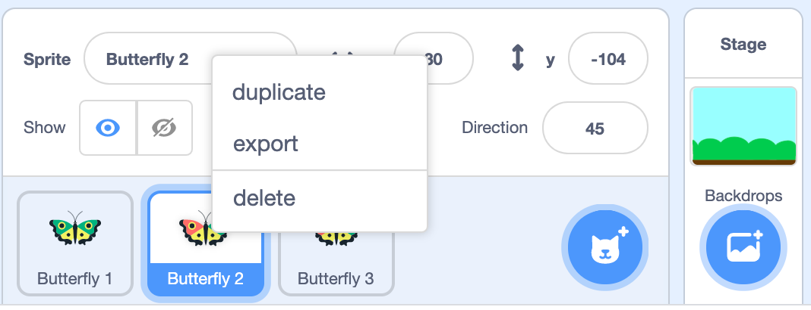
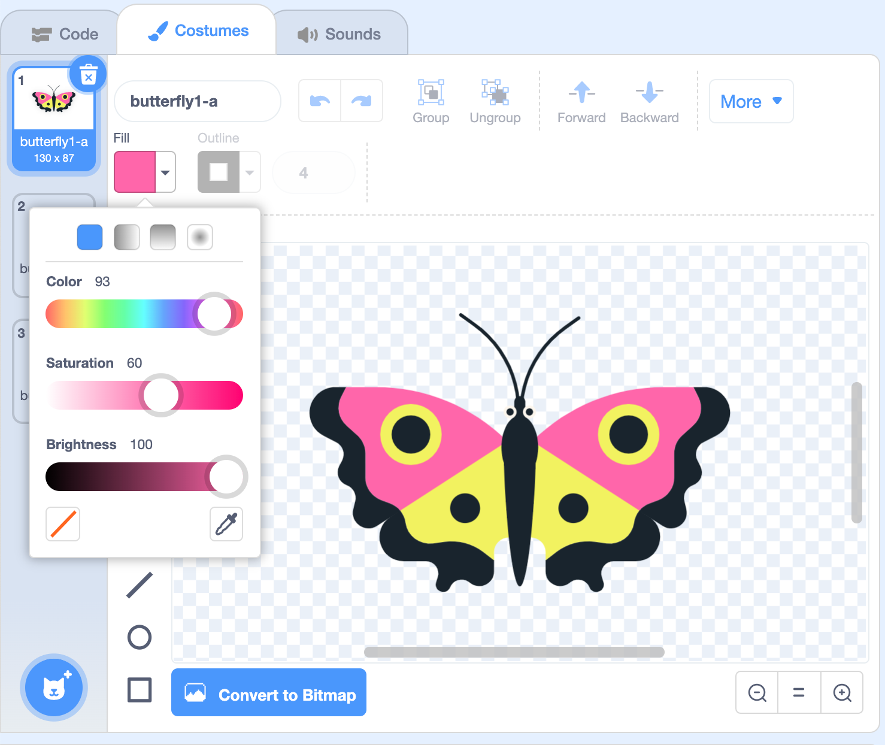

## Round and round

In computing, a clear set of instructions is called an __algorithm__. The next butterfly is going to use a different algorithm to fly in a circle. 

--- task ---
Duplicate Butterfly 2 to create a new sprite. If you created Butterfly 3 in the challenge then this will be Butterfly 4.



--- /task ---

--- task ---
Change the colour of the new butterfly so you can easily identify it. 



--- /task ---

--- task ---
Add a `go to x: () y: ()`{:class="block3motion"} after the `when green flag clicked`{:class="block3motion"} block. The numbers in the block will be the current coordinates of the butterfly on the stage. 

Change the x and y coordinates to 0 so your code looks like this:

```blocks3
when flag clicked
+go to x: (0) y: (0)
point in direction (45)
forever
move (2) steps
if on edge bounce
end
```
--- /task ---

--- task ---
Change the direction to 90 so the butterfly starts off pointing to the right:
```blocks3
when flag clicked
go to x: (0) y: (0)
+point in direction (90)
forever
move (2) steps
if on edge bounce
end
```
--- /task ---

--- task ---
Now add a `turn right` (clockwise) block and change the number to 2 so that the butterfly changes direction by a small amount each time it moves:

```blocks3
when flag clicked
go to x: (0) y: (0)
point in direction (90)
forever
move (2) steps
+turn right (2) degrees
if on edge bounce
end
```blocks3

--- /task ---

--- task ---
Click the green flag and watch your butterfly fly in a circle. 


--- /task ---


