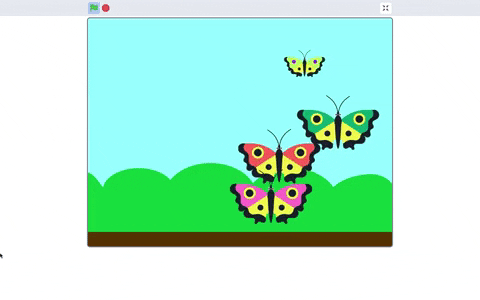

## Round and round

In computing, a clear set of instructions is called an **algorithm**. The next butterfly is going to use a different algorithm to make it fly in a circle. 

--- task ---
Duplicate the **Butterfly 2** sprite to create a new sprite. This will automatically be called **Butterfly 4**.


--- /task ---

--- task ---
Change the colour of the **Butterfly 4** sprite so that you can identify it easily. 


--- /task ---

--- task ---
Add a `go to x: y:`{:class="block3motion"} block after the `when green flag clicked`{:class="block3events"} block. The numbers in the block will be the current coordinates of the butterfly on the Stage. 

The centre of the Stage is at coordinates `x:`{:class="block3motion"} `0` `y:`{:class="block3motion"} `0`. Change the numbers in the `go to x: y:`{:class="block3motion"} block so that your butterfly starts its flight in the centre of the Stage:

```blocks3
when flag clicked
+go to x: (0) y: (0)
set rotation style [left-right v]
point in direction (45)
forever
move (2) steps
if on edge, bounce
end
```
--- /task ---

--- task ---
Change the direction to `90` (degrees) so that the butterfly points to the right at the start of the program:

```blocks3
when flag clicked
go to x: (0) y: (0)
set rotation style [left-right v]
+point in direction (90)
forever
move (2) steps
if on edge, bounce
end
```
--- /task ---

--- task ---
Now, add a `turn right`{:class="block3motion"} (clockwise) block and change the number of degrees to `2` so that the butterfly changes direction by a small amount each time it moves:

```blocks3
when flag clicked
go to x: (0) y: (0)
set rotation style [left-right v]
point in direction (90)
forever
move (2) steps
+turn right (2) degrees
if on edge, bounce
end
```
--- /task ---

--- task ---
Click on the green flag and watch your butterfly fly in a circle. 

--- /task ---

--- no-print ---



--- /no-print ---

--- save ---
